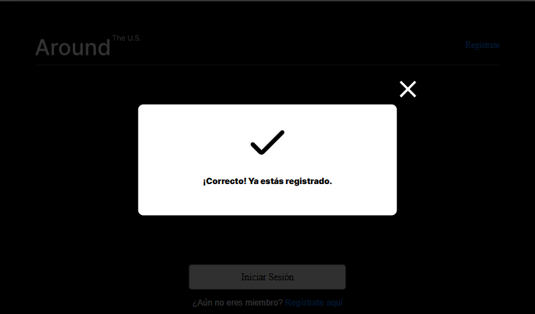

# Around the World — Full Stack API

## Descripción

**Around the World** es una aplicación web full-stack de red social para compartir fotografías de lugares alrededor del mundo. Los usuarios pueden registrarse, iniciar sesión, publicar tarjetas con imágenes, dar "me gusta" a las publicaciones de otros usuarios y gestionar su perfil.

### Funcionalidades principales

- Registro e inicio de sesión con autenticación JWT
- Visualización del feed de tarjetas de todos los usuarios
- Publicación de nuevas tarjetas con nombre e imagen
- Eliminar tarjetas propias
- Dar y quitar "me gusta" a tarjetas
- Editar nombre y descripción del perfil
- Actualizar avatar del perfil

---

## Capturas de pantalla

### Demostración de registro de usuario


### Registro exitoso


### Pantalla del perfil de usuario


### Demostración de cómo agregar tarjetas


---

## Tecnologías y técnicas utilizadas

### Backend
| Tecnología | Uso |
|---|---|
| **Node.js** | Entorno de ejecución del servidor |
| **Express.js** | Framework web para la API REST |
| **MongoDB + Mongoose** | Base de datos NoSQL y ODM |
| **JWT (jsonwebtoken)** | Autenticación stateless con tokens de 7 días |
| **bcryptjs** | Hash seguro de contraseñas (10 rondas) |
| **celebrate + Joi** | Validación de datos de entrada en rutas |
| **cors** | Habilitación de peticiones cross-origin |
| **winston + express-winston** | Logging de peticiones (`request.log`) y errores (`error.log`) |
| **validator** | Validación de URLs |
| **ESLint (airbnb-base)** | Linting y estilo de código |
| **nodemon** | Reinicio automático en desarrollo |

### Frontend
| Tecnología | Uso |
|---|---|
| **React 18** | Biblioteca de interfaz de usuario |
| **React Router DOM** | Enrutamiento del lado del cliente |
| **Vite** | Bundler y servidor de desarrollo |
| **CSS Modules** | Estilos encapsulados por componente |

### Despliegue e infraestructura
| Tecnología | Uso |
|---|---|
| **Google Cloud Compute Engine** | Servidor virtual en la nube (VM Ubuntu) |
| **nginx** | Servidor web y proxy inverso hacia la API |
| **PM2** | Gestor de procesos Node.js con auto-reinicio |
| **certbot / Let's Encrypt** | Certificado SSL/HTTPS gratuito y renovación automática |
| **mooo.com** | Dominio registrado para frontend y subdominio de API |

### Arquitectura y patrones
- API RESTful con respuestas JSON
- Manejo centralizado de errores con middleware Express
- Autenticación mediante Bearer Token en cabecera `Authorization`
- Validación de esquemas con celebrate/Joi antes de llegar a los controladores
- Rutas protegidas con middleware de autenticación
- Logging separado de peticiones y errores con Winston
- Recuperación automática del servidor tras crash mediante PM2

---

## URL de la App

**Frontend:** [https://www.proyectodiecinueve.mooo.com](https://www.proyectodiecinueve.mooo.com)

**Backend API:** [https://www.apiproyectodiecinueve.mooo.com](https://www.apiproyectodiecinueve.mooo.com)

---

## Instalación local

### Backend
```bash
cd backend
npm install
npm run dev
```

### Frontend
```bash
cd frontend
npm install
npm run dev
```

El backend corre en `http://localhost:3000` y el frontend en `http://localhost:5173` por defecto.
